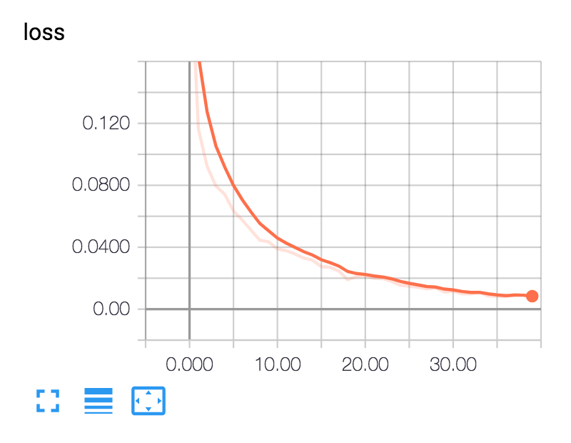
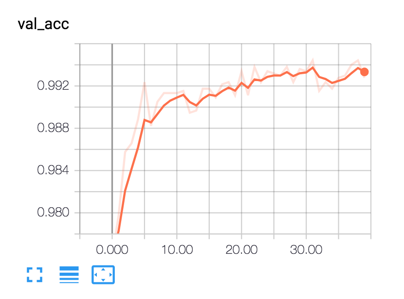
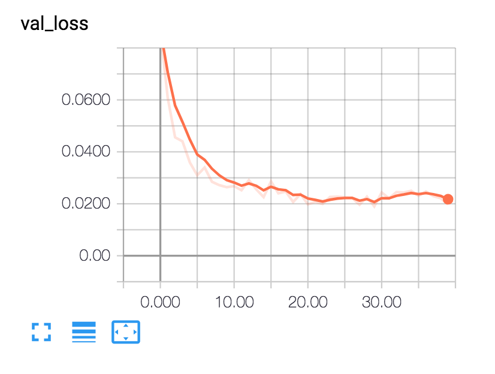
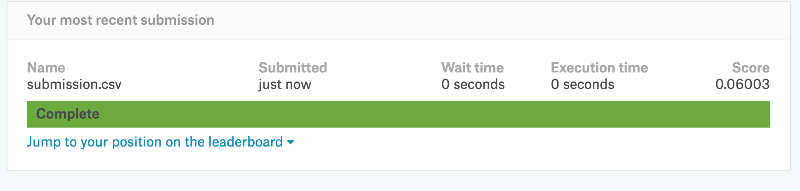

# Dog VS Cat

猫狗大战是kaggle比赛中的题目，要求最终测试集的结果排在Public Leaderboard的前10%，也就是说logloss要小于0.06127。

## Usage

### format dataset

从kaggle下载的数据一共提供了两个数据集train与test，其中train set包含25000个样本，cat和dog各12500个。把train set按照10%的比例分为训练集和验证集，并保存为如下面的结构所示：

```text
data/
    train/
        dogs/
            dog001.jpg
            dog002.jpg
            ...
        cats/
            cat001.jpg
            cat002.jpg
            ...
    validation/
        dogs/
            dog001.jpg
            dog002.jpg
            ...
        cats/
            cat001.jpg
            cat002.jpg
            ...
```

执行下面的命令划分数据集：

  ```shell
  python train/format_dataset.py $source_dir $target_dir --val_ratio 0.1
  ```
其中 **$source_dir** 表示从kaggle中下载的train数据集所在的文件路径，**$target_dir** 表示按照上面格式划分好的数据集的存储路径

### training

执行下面的命令训练模型：

  ```shell
  python train/train_resnet50.py $train_dataset_dir $validation_dataset_dir --batch_size 16 --epochs 100 --lr 0.0001
  ```
其中 **$train_dataset_dir**表示**$target_dir**路径下的train文件夹路径，**$validation_dataset_dir**表示**$target_dir**路径下的
validation文件夹路径

### evaluate

执行下面的命令测试模型：

```shell
  python train/evaluate.py weights_file_path $test_dataset_dir --out_dir $out_dir
```
其中**$test_dataset_dir**表示从kaggle中下载的test数据集所在的文件路径,**weights_file_path**是指从training step中训练出的最佳模型
的weigths文件路径，**$out_dir**表示结果输出文件路径

## Training Process

本项目的代码运行在aws p3.2xlarge ec2 instance上，一共运行40个epoch，下图是tensorboard对运行过程的展示：








其中epoch39产生的weights是这40个epoch中的最佳模型，然后用最佳模型测试test数据集，得到了 **submission.csv**文件，下面是上传
**submission.csv**到kaggle的结果：


